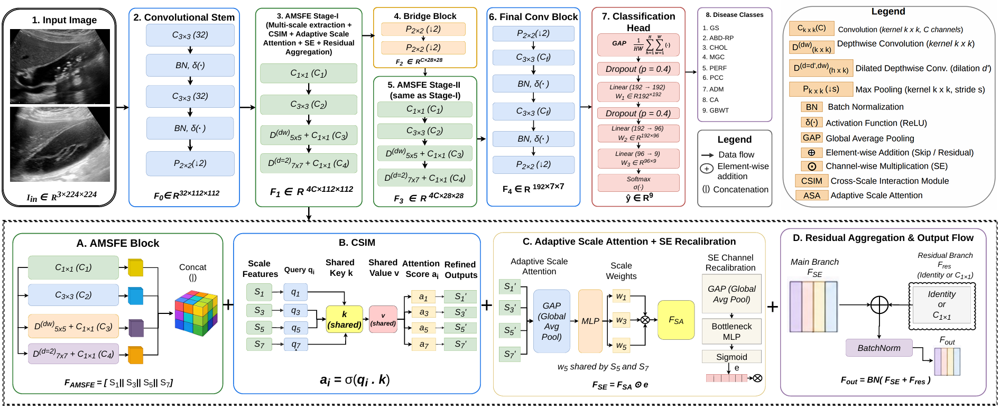

# ACMS-Net: A Lightweight Adaptive Multi-Scale Feature Learning with Cross-Scale Attention Network for Multi-Class Classification of Gallbladder Diseases in Ultrasound Images

[]()
[](https://data.mendeley.com/datasets/r6h24d2d3y/1)
[](#license)

Official PyTorch implementation of **ACMS-Net**, a lightweight Adaptive Cross-Scale Multi-Scale Attention Network for multi-class gallbladder (GB) disease classification from ultrasound (US) images.

## Overview

Gallbladder disease encompasses a wide range of conditions, including gallstones, cholecystitis, adenomyomatosis, and carcinoma. Many of these look similar on ultrasound, especially when wall thickening is present, making multi-class diagnosis a genuinely hard problem. Recent deep learning models have pushed accuracy above 98% on this task, but most depend on large backbones, capsule-routing designs, or transformers that are too heavy for low-resource clinical settings where ultrasound is often the only imaging option available.

To close this gap, we propose **ACMS-Net**, which combines:
- A four-branch **Adaptive Multi-Scale Feature Extraction (AMSFE)** block
- A **Cross-Scale Interaction Module (CSIM)** built on query-key-value attention
- An **Adaptive Scale Attention** mechanism that learns input-dependent scale importance
- **Squeeze-and-Excitation (SE)** channel recalibration

all within a compact residual design.

On the **UIdataGB** dataset (10,692 images across nine disease classes), ACMS-Net reaches **99.91% accuracy**, **99.98% specificity**, and an **MCC of 99.89%**, matching or beating seventeen existing methods while using only **0.85M parameters**, **1.05 GFLOPs**, and **3.71 ms** inference time per image (**269.62 FPS**) — up to two orders of magnitude smaller than comparable transfer-learning and transformer-based models. Grad-CAM, attention-map, and t-SNE analysis further show that the model focuses on clinically meaningful regions rather than background noise, giving it built-in interpretability that most high-accuracy baselines lack.

## Architecture



*Figure: Overall architecture of the proposed ACMS-Net. The network begins with a convolutional stem for low-level feature extraction, followed by two Adaptive Multi-Scale Feature Extraction (AMSFE) stages connected via a transition (bridge) block. Each AMSFE stage integrates four-branch multi-scale feature extraction, a Cross-Scale Interaction Module (CSIM), Adaptive Scale Attention and Squeeze-and-Excitation (SE) channel recalibration, combined with a residual connection. The final convolutional block, global average pooling and fully connected classifier produce the nine-class disease prediction.*

### Key Components

| Component | Description |
|---|---|
| Convolutional Stem | Two 3×3 conv layers + BN + ReLU + max-pooling for low-level feature extraction |
| AMSFE Block | Four parallel branches (point-wise, 3×3, depthwise-separable 5×5, dilated depthwise 7×7) capturing complementary receptive-field scales |
| CSIM | Query-key-value attention enabling bidirectional information exchange across scales |
| Adaptive Scale Attention | Learns soft, input-dependent weighting over scale groups |
| SE Recalibration | Fine-grained, per-channel feature recalibration |

## Contributions

- We propose ACMS-Net, a lightweight network that jointly integrates multi-scale feature extraction with cross-scale interaction and adaptive attention for efficient multi-class gallbladder disease classification from ultrasound images.
- We introduce a Cross-Scale Interaction Module (CSIM), which enables bidirectional information exchange across multiple receptive fields through query-key-value attention, allowing each feature scale to be adaptively refined according to the global multi-scale context.
- We design an Adaptive Scale Attention mechanism that dynamically assigns input-dependent importance to different receptive-field scales, enabling adaptive selection of local, medium and wide-context features without manually predefined scale priorities.
- We demonstrate that combining CSIM and Adaptive Scale Attention within a single AMSFE stage yields complementary scale recalibration at the inter-scale relational level (CSIM) and the global importance level (scale attention), which we validate through ablation on gallbladder ultrasound classification.

## Dataset

This study uses **UIdataGB**, a publicly available multi-class ultrasound dataset for gallbladder disease detection (Turki et al., 2024).

- **Direct dataset access:** [https://data.mendeley.com/datasets/r6h24d2d3y/1](https://data.mendeley.com/datasets/r6h24d2d3y/1)
- **Size:** 10,692 B-mode images from 1,782 patients
- **Classes:** 9 diagnostic categories — Gallstones (GS), Abdomen and Retroperitoneum (ABD-RP), Cholecystitis (CHOL), Membranous and Gangrenous Cholecystitis (MGC), Perforation (PERF), Polyps and Cholesterol Crystals (PCC), Adenomyomatosis (ADM), Carcinoma (CA), Gallbladder Wall Thickening (GBWT)
- **Source:** Three tertiary referral centers in Baghdad, Iraq, collected retrospectively over four years using four clinical-grade ultrasound systems (Siemens Acuson X700, Philips Affiniti 70, Philips CX50, Canon Viamo C100)
- **Split:** Train 80% (8,551) / Validation 10% (1,069) / Test 10% (1,072), performed at the image level

## Results

### Performance Comparison

| Method | Accuracy | Precision | Recall | Specificity | F1-score | MCC |
|---|---|---|---|---|---|---|
| GBCapsNet (Golla et al., 2026) | 99.91% | 100% | 100% | – | 100.00% | – |
| EfficientViT (Elbedwehy et al., 2026) | 99.86% | 99.67% | 99.78% | – | 99.78% | – |
| MSFE-GallNet-X (Nabil et al., 2025) | 99.63% | 99.60% | 99.40% | – | 99.50% | – |
| **ACMS-Net (Proposed)** | **99.91%** | 99.91% | 99.91% | **99.98%** | 99.92% | **99.89%** |

*Full comparison against seventeen existing methods is provided in the paper.*

### Computational Efficiency

| Method | Params (M) | Inference Time (ms/step) | FLOPs | FPS | Accuracy |
|---|---|---|---|---|---|
| EfficientViT–AlexNet (Elbedwehy et al., 2026) | 318.16 | – | – | – | 99.86% |
| VGG-19 | 74.47 | 536 | – | – | 98.89% |
| GallNet-X (without MSFE) | 0.87 | 223 | – | – | 96.68% |
| **ACMS-Net (Proposed)** | **0.85** | **3.71** | **1.05 G** | **269.62** | **99.91%** |

### Ablation Study

| Configuration | Accuracy (%) |
|---|:---:|
| Lightweight backbone only | 97.84 |
| Backbone + Multi-Scale Feature Extraction (MSFE) | 98.76 |
| Backbone + CSIM only | 98.42 |
| Backbone + Adaptive Scale Attention only | 98.21 |
| Backbone + SE only | 98.08 |
| Backbone + CSIM + Adaptive Scale Attention | 99.34 |
| **ACMS-Net (full model)** | **99.91** |

## Repository Structure

```
ACMS-Net/
├── ACMS-Net.py                          # Main ACMS-Net model definition
├── ACMS-Net with Transition Block.py    # ACMS-Net variant with transition-block final conv stage
├── config.py                            # Hyperparameters and configuration settings
├── dataloader.py                        # Dataset loading and preprocessing/augmentation pipeline
├── train.py                             # Training script
├── test.py                              # Evaluation / inference script on the held-out test set
├── utils.py                             # Helper functions (metrics, logging, checkpointing, etc.)
├── XAI.py                               # Grad-CAM, attention-map, feature-map and t-SNE visualization
├── complexity analysis.py               # Parameter count, FLOPs and inference-speed benchmarking
├── train_results/                       # Training curves, logs and saved checkpoints
└── test_results/                        # Test-set metrics, confusion matrix, ROC/PR curves, XAI outputs
```

## Installation

```bash
git clone https://github.com/Rashed200613/ACMS-Net.git
cd ACMS-Net
pip install -r requirements.txt
```

### Environment

- Python 3.10.19
- PyTorch 2.5.1
- Trained and evaluated on: Intel Core i7-13700H, 32 GB DDR5 RAM, NVIDIA RTX 2000 Ada Generation Laptop GPU (8 GB VRAM), Windows 11 Pro

## Usage

### 1. Download the dataset
Download UIdataGB from the [Mendeley Data repository](https://data.mendeley.com/datasets/r6h24d2d3y/1) and update the dataset path in `config.py`.

### 2. Train the model
```bash
python train.py
```

### 3. Evaluate on the test set
```bash
python test.py
```

### 4. Generate interpretability visualizations (Grad-CAM, attention maps, feature maps, t-SNE)
```bash
python XAI.py
```

### 5. Compute model complexity (parameters, FLOPs, inference speed)
```bash
python "complexity analysis.py"
```

## Hyperparameters

| Hyperparameter | Value |
|---|---|
| Input image size | 224 × 224 |
| Batch size | 16 |
| Number of epochs | 100 |
| Optimizer | AdamW |
| Initial learning rate | 3 × 10⁻⁴ |
| Weight decay | 1 × 10⁻⁴ |
| LR scheduler | ReduceLROnPlateau (mode=min, patience=3, factor=0.5) |
| Loss function | Cross-Entropy Loss |
| Random seed | 42 |

## Citation

If you use this code or dataset in your research, please cite:

```bibtex
@article{rashed2026acmsnet,
  title   = {ACMS-Net: A Lightweight Adaptive Multi-Scale Feature Learning with Cross-Scale Attention Network for Multi-Class Classification of Gallbladder Diseases in Ultrasound Images},
  author  = {Rashed, Md. and Hiron, Faisal Iqbal},
  journal = {Preprint submitted to Elsevier},
  year    = {2026}
}
```

Please also cite the dataset:

```bibtex
@article{turki2024uidatagb,
  title   = {UIdataGB: multi-class ultrasound images dataset for gallbladder disease detection},
  author  = {Turki, A. and Obaid, A. and Bellaaj, H. and Ksantini, M. and AlTaee, A.},
  journal = {Data in Brief},
  volume  = {54},
  pages   = {110426},
  year    = {2024}
}
```

## Data Availability

The dataset used in this study is publicly available on the Mendeley Data repository at: [https://data.mendeley.com/datasets/r6h24d2d3y/1](https://data.mendeley.com/datasets/r6h24d2d3y/1)

## Code Availability

The source code, trained model weights, and data preparation scripts used in this study are available in this repository.

## License

This project is released under the MIT License. See the [LICENSE](LICENSE) file for details.

## Contact

For questions regarding this work, please contact:
- Md. Rashed — rashedulislam.ice.pust@gmail.com
